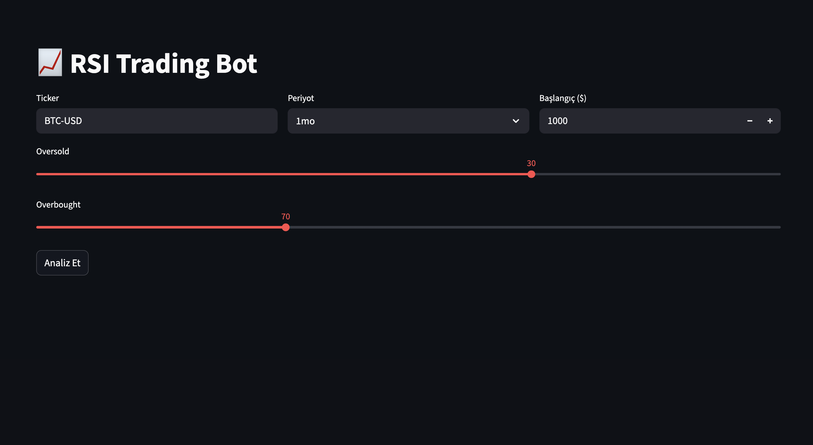
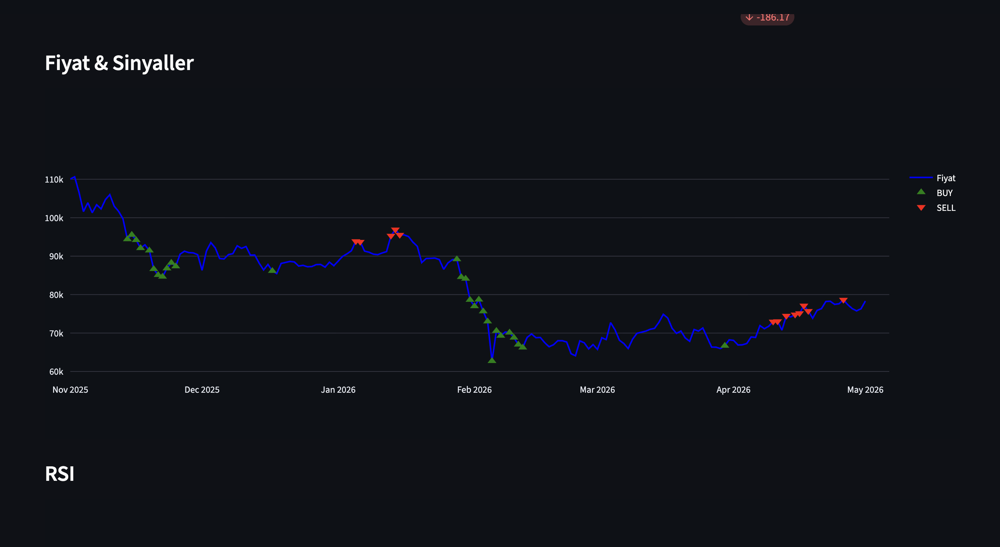
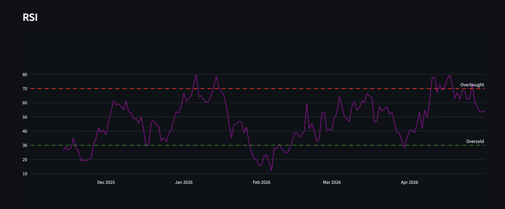
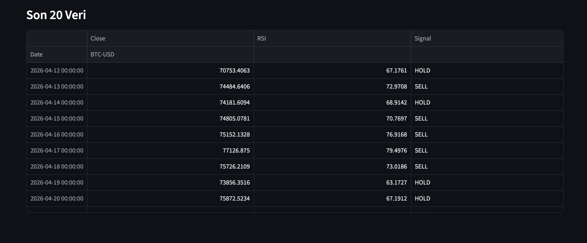

# RSI Signal Bot

Basit RSI (Relative Strength Index) indikatörü kullanarak 
al/sat sinyali üreten ve simülasyon yapan trading botu.

## Ne Yapıyor?

- yfinance ile gerçek piyasa verisi çekiyor
- RSI hesaplıyor ve BUY/SELL/HOLD sinyali üretiyor
- Başlangıç sermayesiyle simülasyon yapıyor

## Sonuçlar

| Metrik | Değer |
|--------|-------|
| Strateji | RSI (14) |
| Oversold Eşiği | < 30 → BUY |
| Overbought Eşiği | > 70 → SELL |
| Test Periyodu | 1 Yıl - 6 ay - 3 ay - 1 ay|

## Teknolojiler

Python · yfinance · Pandas · Plotly · Streamlit

## 📁 Proje Yapısı

trading-bot-01-rsi/
├── src/
│   ├── data.py          ← veri çekme
│   ├── indicators.py    ← RSI hesaplama  
│   └── simulation.py    ← sermaye simülasyonu
├── app/
│   └── app.py           ← Streamlit dashboard
├── requirements.txt
└── README.md

## Nasıl Çalıştırılır?

pip install -r requirements.txt
streamlit run app/app.py

## Demo

### Açılış Sayfası

### Analiz Sonuçları

### Fiyat + Sinyal Grafiği

### RSI Grafiği

### 20 Günlük Analiz

